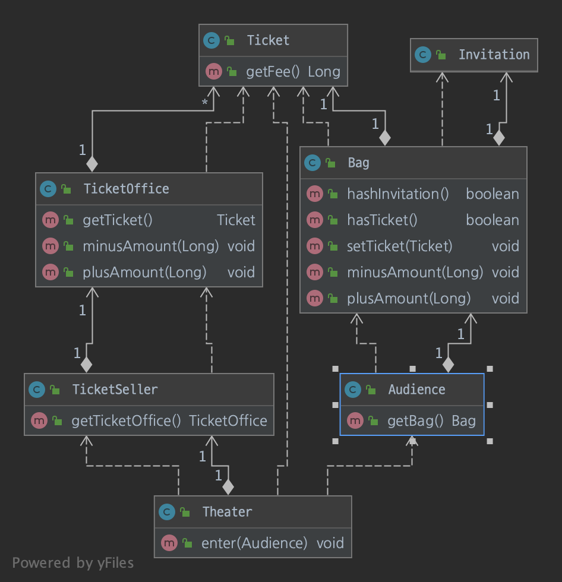
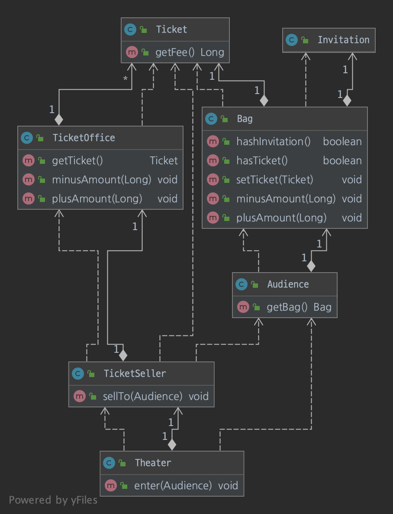
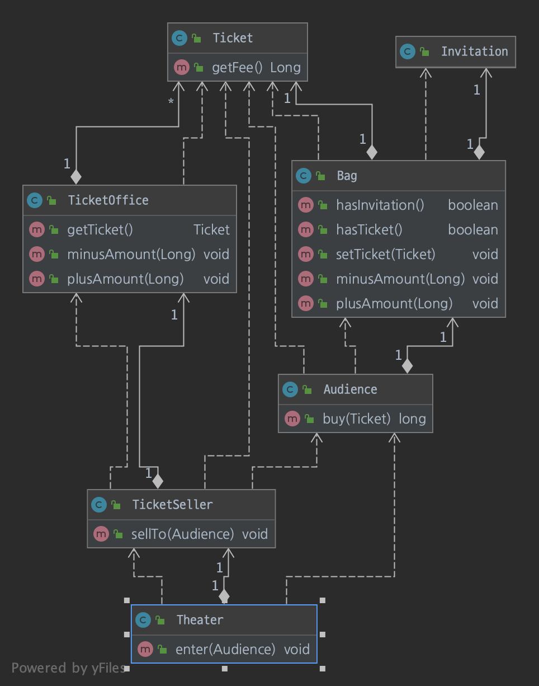
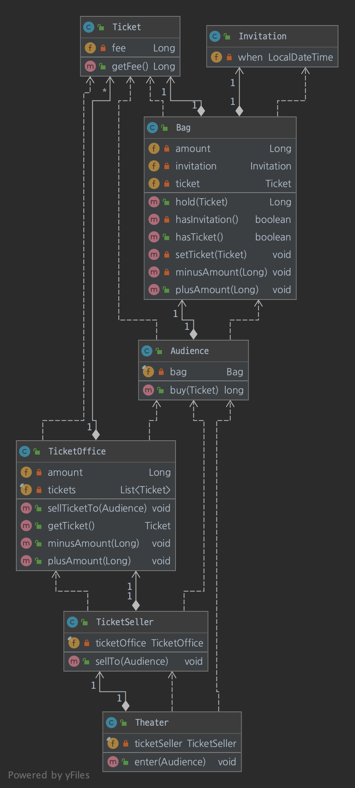
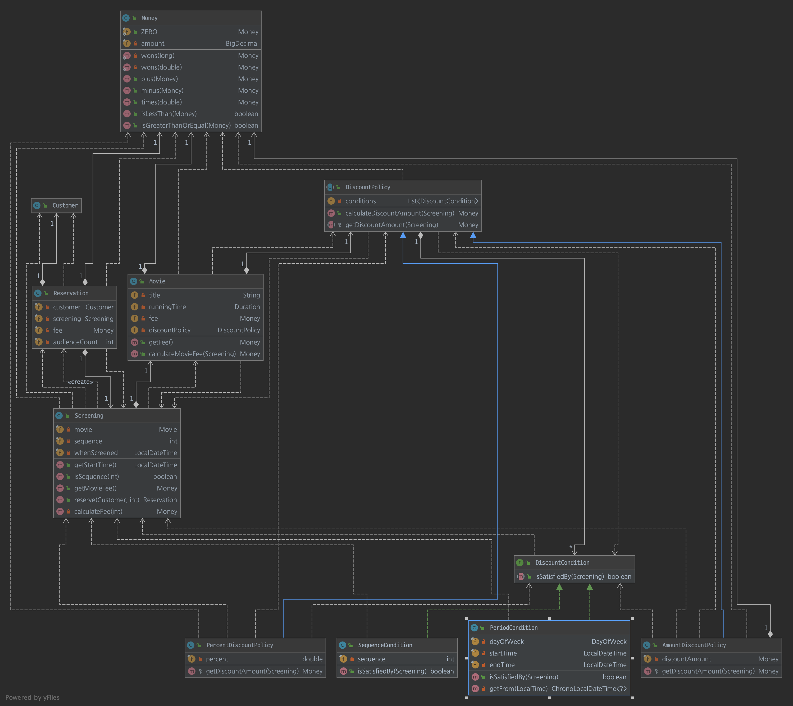
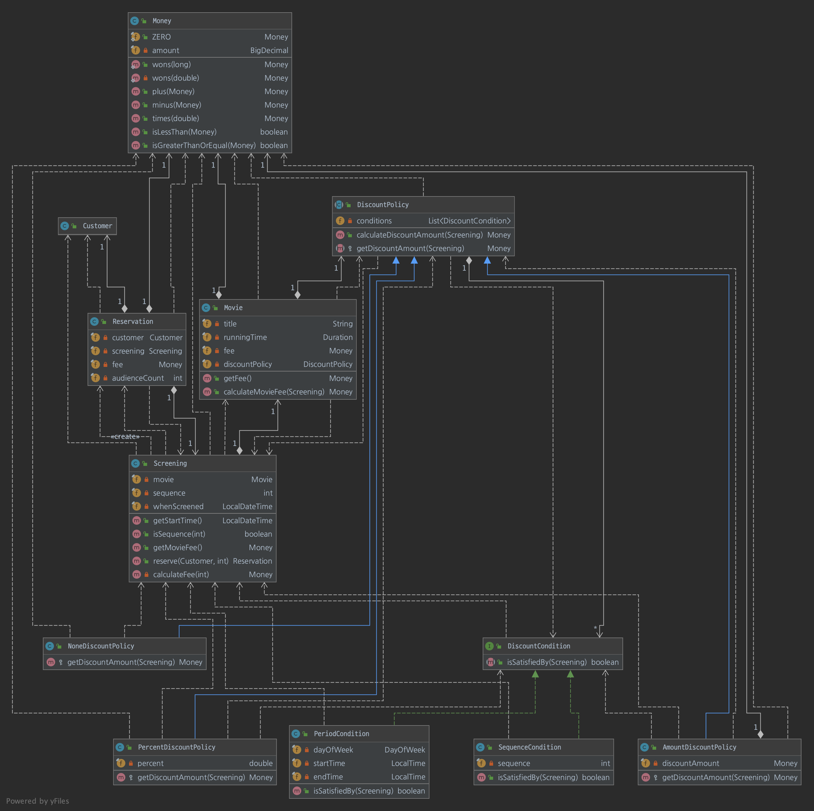
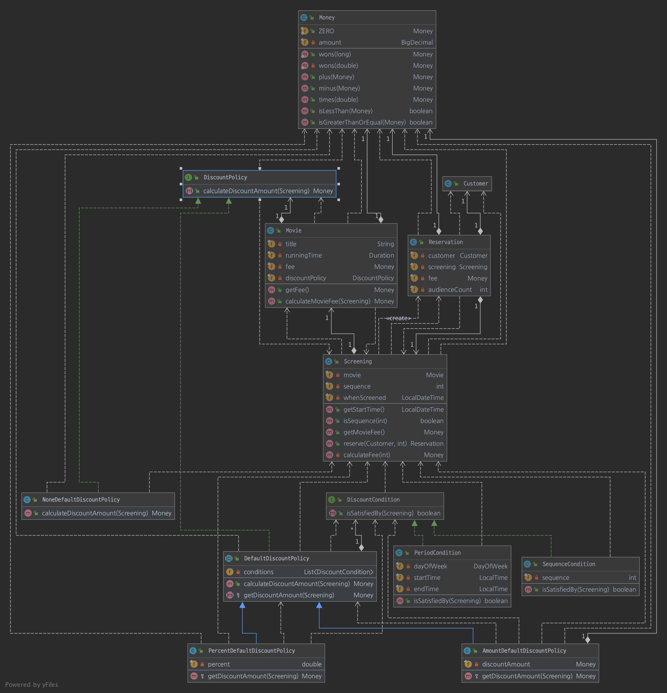
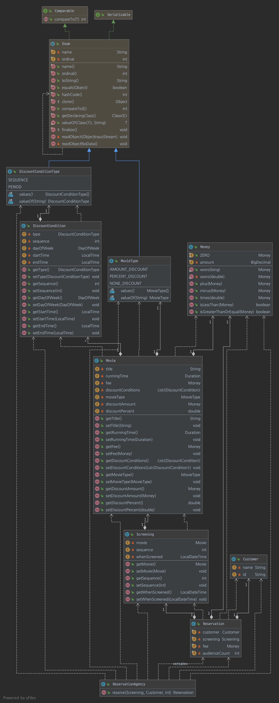
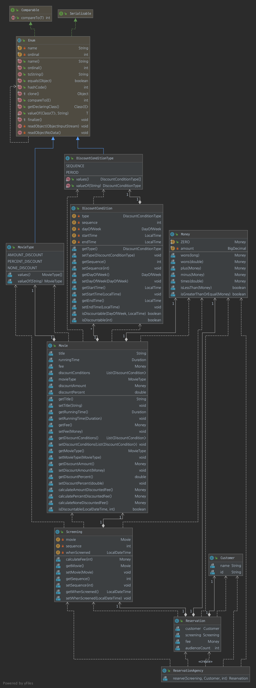
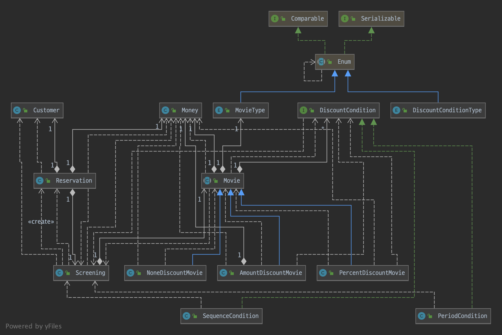

# Object-oriented Programming: OOP

## 객체지향의 사실과 오해

1. 객체지향 패러당미의 핵심은 자율적인 객체들의 협력하는 것
2. 객체는 상태와 행동, 식별자를 가진 존재
3. 추상화는 동적인 객체들을 단순화시켜 정적인 타입으로 갈무리하는 것
4. 객체들은 협력에 참여하기 위해 특정한 역할을 맡고 역할에 적합한 책임을 수행한다.
5. 훌륭한 메시지를 선택하므로써 객체의 자율성과 설계의 유연성으로 객체지향 설계의 기반이 된다는 것
6. 객체지향 패러다임은 객체들의 구조안에 기능을 녹임으로써 변화에 안정적인 소프트웨어를 개발하는 것
7. 1 ~ 6 까지의 유기적인 흐름을 코드로 녹여 구현한 것

### 1. 협력하는 객체들의 공동체

역할과 책임, 협력에 대한 이야기

## 오브젝트

* 시나리오 대로 1차 코드 작성
* 문제점
	* 코드의 로직이 한 곳에 몰려 있어 변경에 취약함
	* 객체 사이의 의존성이 높음 -&gt; 결합도가 높음
* 해결책
	* 책임의 이동

### 영화 예매

* NoneDiscountPolicy 추가

* 인터페이스 도입

* 리펙토링한 구조도 결국 할인 정책에서 상속을 이용하고 있기 때문에 실행 중에 영화의 할인 정책을 변경하기 위해서 새로운 인스턴스를 생성해야한다.
* 이 해결 방법으로 합성을 이용한 구조로 변경 해야 한다.
* DiscountPolicy로 분리한 뒤 Movie에 합성하여 유연한 설계를 해야한다.
